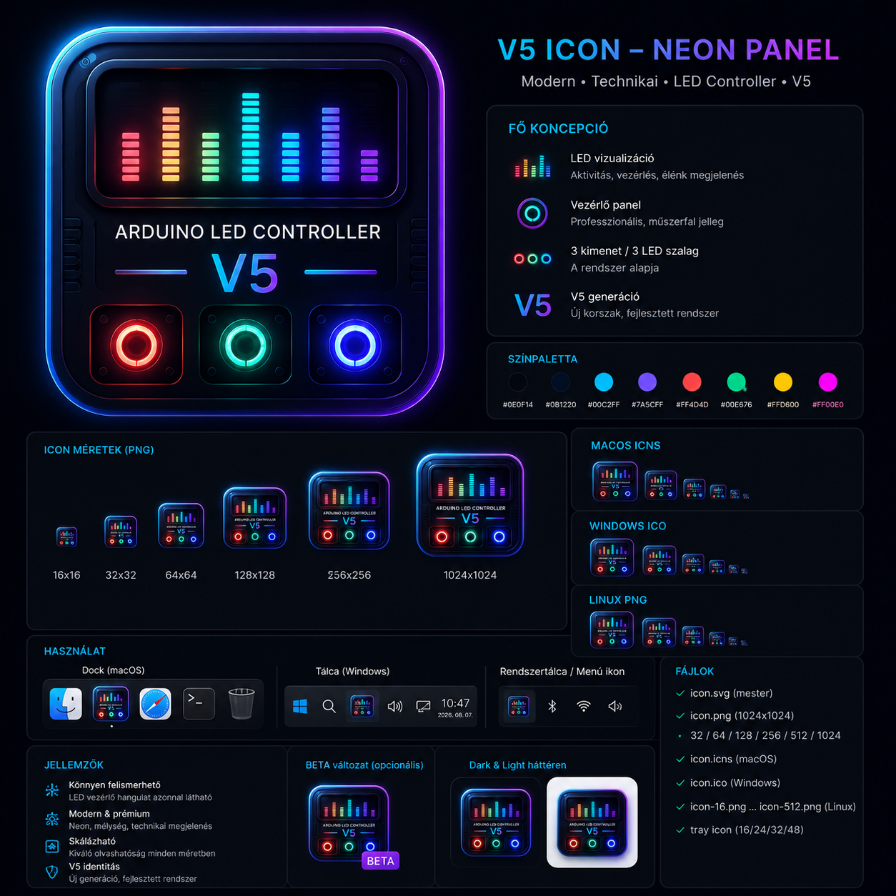

# Arduino LED Controller V5.8

<!-- CURRENT_VERSION_SSOT_BEGIN -->
Current application: `5.8.0-beta.3`
Current firmware: `5.1.0-beta.3`
Current Direct API: `1.1.0`
<!-- CURRENT_VERSION_SSOT_END -->

## Current Beta development — 5.8.0-beta.3

- Application: `5.8.0-beta.2`
- Theme Engine: `2.0`
- Core UI: `3.0`
- Firmware: `5.1.0-beta.2` Beta
- Direct API: `1.0.0`
- Release notes: `docs/v5/V58_BETA3_RELEASE_NOTES.md`
- Installation guide: `docs/v5/V58_BETA3_INSTALLATION_GUIDE.md`
- Release checklist: `docs/v5/V58_BETA3_RELEASE_CHECKLIST.md`
- Root release notes: `RELEASE_NOTES_5.8.0-beta.3.md`


<p align="center">
  <strong>Direct Arduino Control & Automation</strong>
</p>

[](https://github.com/LexyGuru/arduino-led-controller/actions/workflows/firmware-build.yml)
[](https://github.com/LexyGuru/arduino-led-controller/actions/workflows/firmware-beta-release.yml)
[](https://github.com/LexyGuru/arduino-led-controller/actions/workflows/app-beta-release.yml)

<p align="center">
  
</p>

Többplatformos vezérlő- és automatizálási rendszer **Arduino UNO R4 WiFi** és
három WS2812B LED-szalag számára. A V5.6 közös React felületet használ
desktopon, mobilon és a Debian 13 Rust LXC webes környezetében, miközben az
Arduino továbbra is önálló **Direct API v1** végpontként működik.

---

## Aktuális kiadás

> **Jelenlegi fejlesztési kiadás: Arduino LED Controller V5.8 Beta.2**

| Komponens | Aktuális verzió / állapot |
|---|---|
| Alkalmazás | **`5.8.0-beta.2`** |
| Firmware | **`5.1.0-beta.2` Beta** |
| Direct API | **`1.0.0`** |
| Beta ág | **`next/v5-rearchitecture`** |
| Jelenlegi Stable alkalmazás (`main`) | **`5.6.1`** |
| Stabil ág | `main` |
| Stable firmware | **`5.0.0`** |
| Arduino board | `arduino:renesas_uno:unor4wifi` |
| OTA port | `65280` |
| LXC rendszer | Debian 13 |
| LXC web/API port | `3000` |

A **V5.8 Beta.2** a mobil heti időzítés újratervezésének és a LED-topológia műveleti visszajelzésének tesztbuildje.

### Aktuális kiadási dokumentumok

- [V5.8 Beta.2 release notes](docs/v5/V58_BETA2_RELEASE_NOTES.md)
- [V5.8 Beta.2 telepítési útmutató](docs/v5/V58_BETA2_INSTALLATION_GUIDE.md)
- [V5.8 Beta.2 release checklist](docs/v5/V58_BETA2_RELEASE_CHECKLIST.md)
- [Részletes gyökér release notes](RELEASE_NOTES_5.8.0-beta.2.md)
- [Firmware 5.1.0-beta.1 development notes](firmware/RELEASE_NOTES_5.1.0-beta.1.md)

### Korábbi kiadási dokumentumok

- [V5.8 Beta.1 release notes](docs/v5/V58_BETA1_RELEASE_NOTES.md)
- [V5.8 Beta.1 telepítési útmutató](docs/v5/V58_BETA1_INSTALLATION_GUIDE.md)
- [V5.8 Beta.1 release checklist](docs/v5/V58_BETA1_RELEASE_CHECKLIST.md)
- [V5.8 Beta.1 gyökér release notes](RELEASE_NOTES_5.8.0-beta.1.md)

- [V5.7 Beta.5 release notes](docs/v5/V57_BETA5_RELEASE_NOTES.md)
- [V5.7 Beta.5 telepítési útmutató](docs/v5/V57_BETA5_INSTALLATION_GUIDE.md)
- [V5.7 Beta.5 release checklist](docs/v5/V57_BETA5_RELEASE_CHECKLIST.md)
- [V5.7 Beta.5 gyökér release notes](RELEASE_NOTES_5.7.0-beta.5.md)
- [Firmware 5.0.1-beta.1 release notes](firmware/RELEASE_NOTES_5.0.1-beta.1.md)
- [V5.7 Beta.4 release notes](docs/v5/V57_BETA4_RELEASE_NOTES.md)
- [V5.7 Beta.4 telepítési útmutató](docs/v5/V57_BETA4_INSTALLATION_GUIDE.md)
- [V5.7 Beta.4 release checklist](docs/v5/V57_BETA4_RELEASE_CHECKLIST.md)
- [V5.7 Beta.4 gyökér release notes](RELEASE_NOTES_5.7.0-beta.4.md)

- [V5.6 Beta.5 release notes](docs/v5/V56_BETA5_RELEASE_NOTES.md)
- [V5.6 Beta.5 telepítési útmutató](docs/v5/V56_BETA5_INSTALLATION_GUIDE.md)
- [V5.6 Beta.5 release checklist](docs/v5/V56_BETA5_RELEASE_CHECKLIST.md)
- [V5.6 Beta.5 gyökér release notes](RELEASE_NOTES_5.6.1-beta.5.md)


- [V5.6 Beta.4 release notes](docs/v5/V56_BETA4_RELEASE_NOTES.md)
- [V5.6 Beta.4 telepítési útmutató](docs/v5/V56_BETA4_INSTALLATION_GUIDE.md)
- [V5.6 Beta.4 release checklist](docs/v5/V56_BETA4_RELEASE_CHECKLIST.md)
- [V5.6 Beta.4 gyökér release notes](RELEASE_NOTES_5.6.1-beta.4.md)


- [V5.6 Beta.3 release notes](docs/v5/V56_BETA3_RELEASE_NOTES.md)
- [V5.6 Beta.3 telepítési útmutató](docs/v5/V56_BETA3_INSTALLATION_GUIDE.md)
- [V5.6 Beta.3 release checklist](docs/v5/V56_BETA3_RELEASE_CHECKLIST.md)
- [V5.6 Beta.3 gyökér release notes](RELEASE_NOTES_5.6.1-beta.3.md)


- [V5.6 Beta.2 release notes](docs/v5/V56_BETA2_RELEASE_NOTES.md)
- [V5.6 Beta.2 telepítési útmutató](docs/v5/V56_BETA2_INSTALLATION_GUIDE.md)
- [V5.6 Beta.2 release checklist](docs/v5/V56_BETA2_RELEASE_CHECKLIST.md)
- [V5.6 Beta.2 gyökér release notes](RELEASE_NOTES_5.6.1-beta.2.md)


- [V5.6 Beta.1 release notes](docs/v5/V56_BETA1_RELEASE_NOTES.md)
- [V5.6 Beta.1 telepítési útmutató](docs/v5/V56_BETA1_INSTALLATION_GUIDE.md)
- [V5.6 Beta.1 release checklist](docs/v5/V56_BETA1_RELEASE_CHECKLIST.md)
- [V5.6 Beta.1 gyökér release notes](RELEASE_NOTES_5.6.1-beta.1.md)

- [V5.5.1 Beta.6 release notes](docs/v5/V55_BETA6_RELEASE_NOTES.md)
- [V5.5.1 Beta.6 telepítési útmutató](docs/v5/V55_BETA6_INSTALLATION_GUIDE.md)
- [V5.5.1 Beta.6 release checklist](docs/v5/V55_BETA6_RELEASE_CHECKLIST.md)
- [V5.5.1 Beta.6 gyökér release notes](RELEASE_NOTES_5.5.1-beta.6.md)
- [V5.5.1 Beta.5 release notes](docs/v5/V55_BETA5_RELEASE_NOTES.md)
- [V5.5.1 Beta.5 telepítési útmutató](docs/v5/V55_BETA5_INSTALLATION_GUIDE.md)
- [V5.5.1 Beta.5 release checklist](docs/v5/V55_BETA5_RELEASE_CHECKLIST.md)
- [V5.5.1 Beta.5 gyökér release notes](RELEASE_NOTES_5.5.1-beta.5.md)
- [V5.5.1 Beta.4 release notes](docs/v5/V55_BETA4_RELEASE_NOTES.md)
- [V5.5.1 Beta.4 telepítési útmutató](docs/v5/V55_BETA4_INSTALLATION_GUIDE.md)
- [V5.5.1 Beta.4 release checklist](docs/v5/V55_BETA4_RELEASE_CHECKLIST.md)
- [V5.5.1 Beta.4 gyökér release notes](RELEASE_NOTES_5.5.1-beta.4.md)
- [V5.5.1 Beta.1 release notes](docs/v5/V55_BETA1_RELEASE_NOTES.md)
- [V5.5.1 Beta.1 telepítési útmutató](docs/v5/V55_BETA1_INSTALLATION_GUIDE.md)
- [V5.5.1 Beta.1 release checklist](docs/v5/V55_BETA1_RELEASE_CHECKLIST.md)
- [V5.5.1 Beta.1 gyökér release notes](RELEASE_NOTES_5.5.1-beta.1.md)
- [V5.5 Beta.3 release notes](docs/v5/V55_BETA3_RELEASE_NOTES.md)
- [V5.5 Beta.3 telepítési útmutató](docs/v5/V55_BETA3_INSTALLATION_GUIDE.md)
- [V5.5 Beta.3 release checklist](docs/v5/V55_BETA3_RELEASE_CHECKLIST.md)
- [V5.5 Beta.3 gyökér release notes](RELEASE_NOTES_5.5.0-beta.3.md)
- [Firmware 5.0.0-beta.8 release notes](firmware/RELEASE_NOTES_5.0.0-beta.8.md)

A korábbi Beta dokumentumok történeti snapshotok; nem az aktuális kiadás leírásai.

---

## Mit tartalmaz a V5.6 Beta.6?

### P1 — Release Runner Resilience

- Közös Linux/Tauri dependency installer.
- APT retry, network timeout és dpkg lock timeout.
- Noninteractive install, parancs- és workflow-step timeout.
- Beragadt dependency install helyett korlátozott idejű, diagnosztizálható release-lépés.


### Beta.3 P0 architektúra-konszolidáció

- A kanonikus alkalmazásverzió forrása a `release-versions.json`.
- A Beta workflow verziója, ága és csatornája SSOT metadata alapján működik.
- A default regresszió a current + regression tesztarchitektúrát futtatja; a történeti lánc külön auditként megmarad.
- A Device Key contract Stable javítása Beta-identitás megtartásával került forward-syncre.
- Minden GitHub alkalmazáspublikáció kötelező új alkalmazásverziót és teljes release-dokumentációt kap.
- Firmware: `5.0.0-beta.10` változatlan; Direct API: `1.0.0`.


### Közös alkalmazásplatform

- **Theme Engine 2.0** – világos/sötét mód, Arctic és Midnight presetek,
  kiemelőszínek, sűrűség, lekerekítés és glass beállítások.
- **Core UI 2.0** – reszponzív Sidebar, Topbar és mobil BottomNav.
- **Dashboard 2.0** – valós Arduino-, schedule-, audit- és aktivitási adatok.
- **Statistics 1.0** – kizárólag valós adatok, szintetikus history nélkül.
- **Activity & Logs 2.0** – Arduino konzol, helyi műveletek és Tauri audit.
- **Management UI 2.0** – Firmware, Schedules és Settings felületek.
- **Update System 2.0** – stable/beta csatorna és automatikus ellenőrzés.
- Egyetlen shared React UI desktop, iOS/iPadOS, Android és LXC számára.

### LED és automatizálás

- 3 × WS2812B LED-szalag közvetlen vezérlése;
- fényerő, RGB-szín, effekt és sebesség;
- gyors presetek és tömeges LED-műveletek;
- legfeljebb 60 Arduino EEPROM schedule rekord;
- schedule revision/checksum és konfliktusvédelem;
- tranzakciós schedule írás;
- JSON import/export;
- automatikus schedule backup és visszaállítás;
- Arduino-idő alapú mai/holnapi programnézet;
- autonóm CET/CEST és DST;
- UDP NTP időszinkron.

### Firmware és OTA

- stable/beta firmware-katalógus;
- SHA-256 ellenőrzés letöltés és cache után;
- élő OTA konzol;
- OTA Exclusive Mode az Arduino oldalon;
- reboot utáni `/api/v1/status` életjel-ellenőrzés;
- firmware-verzió, Boot ID és schedule persistence ellenőrzés;
- OTA-jelszó natív secure store-ban;
- firmware és alkalmazás külön release-folyamatban.

---

## GitHub Actions és kiadási architektúra

A repository jelenlegi kanonikus workflow-készlete pontosan hét fájl:

| Workflow | Szerep |
|---|---|
| `app-build.yml` | alkalmazás CI/build engine, nem publikál release-t |
| `app-staging-build.yml` | NEXT/feature staging artifact build, nem publikál release-t |
| `app-beta-release.yml` | kézzel indított Beta alkalmazásrelease |
| `app-stable-release.yml` | kézzel indított Stable alkalmazásrelease |
| `firmware-build.yml` | közös UNO R4 WiFi firmware compile engine |
| `firmware-beta-release.yml` | Beta firmware release + Beta katalógus |
| `firmware-stable-release.yml` | Stable firmware release + Stable katalógus |

A régi `beta-release.yml`, `tauri-desktop.yml` és `tauri-artifact-build.yml` workflow-k ki lettek vezetve.
Az alkalmazásrelease és firmware-release külön folyamat. Egyik release workflow sem indítja el automatikusan a másikat.

### Jelenlegi promóciós sorrend

```text
NEXT / 5.6.1
        ↓
teljes regresszió + manuális Beta QA
        ↓
Application Beta release
        ↓
kiadott Beta build tényleges telepítési/OTA/channel tesztje
        ↓
Stable promóció előkészítése
        ↓
main / 5.6.1 + firmware 5.0.0
```

A `main` jelenleg még `5.1.0`; a `5.6.1` Stable és a `5.0.0` Stable firmware csak a Beta elfogadása után kerülhet promócióra.

---

## Támogatott futtatási környezetek

| Platform | Runtime | Fő feladat |
|---|---|---|
| macOS | Tauri v2 + Rust + React | natív desktop kliens |
| Windows | Tauri v2 + Rust + React | natív desktop kliens |
| Linux | Tauri v2 + Rust + React | natív desktop kliens |
| iOS / iPadOS | Tauri mobile + shared React UI | mobil kliens |
| Android | Tauri mobile + shared React UI | mobil kliens |
| Debian 13 LXC | Rust/Axum + React/Vite | web UI, proxy, központi runtime |
| Arduino UNO R4 WiFi | firmware + Direct API v1 | LED, schedule, OTA, időkezelés |

---

## Architektúra

```text
                         ┌─────────────────────────────┐
                         │ Arduino UNO R4 WiFi         │
                         │ Firmware 5.0.0-beta.10       │
                         │ Direct API v1 / X-Device-Key│
                         └──────────────┬──────────────┘
                                        │
                ┌───────────────────────┴───────────────────────┐
                │                                               │
                ▼                                               ▼
┌───────────────────────────────┐             ┌────────────────────────────────┐
│ Tauri V5.6 Beta.6 client      │             │ Debian 13 Rust LXC             │
│                               │             │                                │
│ macOS / Windows / Linux       │             │ Rust / Axum backend            │
│ iOS / iPadOS / Android        │             │ React / Vite web UI            │
│ Shared React UI               │             │ :3000                          │
│ Direct Arduino API            │             │ Direct API proxy               │
│ Firmware / OTA                │             │ Schedules / logs / LED control│
│ Native credential store       │             │ Self-update + rollback         │
└───────────────────────────────┘             └────────────────────────────────┘
```

A **Direct Arduino mód** az elsődleges kapcsolat. Ehhez nincs külön
alkalmazás-felhasználónév vagy szerverjelszó: a kliens a privát API-prefixet és
az `X-Device-Key` eszközkulcsot használja.

Az LXC opcionális központi runtime; nem szükséges a közvetlen Arduino
vezérléshez.

---

## Direct API és biztonság

A firmware jelenlegi Direct API verziója: **`1.0.0`**.

Fő biztonsági tulajdonságok:

- `X-Device-Key` fejlécalapú hitelesítés;
- query-string kulcsfallback tiltva;
- privát API-prefix;
- JSON body alapú módosító végpontok;
- A/B EEPROM slotok readback ellenőrzéssel;
- tranzakciós schedule írás;
- védett `POST /api/v1/system/reboot`;
- távoli reboot válasz: `HTTP 202 Accepted`.

Titkokat, Device Key-t, OTA-jelszót, `.env`, `update.env` vagy `secrets.h`
fájlt nem szabad commitolni.

---

## OTA frissítés

Az OTA két külön szakaszból áll:

```text
Firmware BIN ellenőrzés
        ↓
OTA feltöltés
        ↓
Arduino flash + reboot
        ↓
Direct API /api/v1/status életjel
        ↓
firmwareVersion + Boot ID + schedule persistence
        ↓
SUCCESS
```

A firmware `5.0.0-beta.10` OTA Exclusive Mode alatt kizárólag a Wi-Fi
kapcsolatot, az ArduinoOTA motort és a LED Matrix visszajelzést hagyja aktívan.
A schedule storage-ot az OTA folyamat nem törli és nem írja újra.

A firmware artifact és checksum a dedikált firmware prerelease része; az
alkalmazásrelease nem csomagolja újra a firmware-t.

---

## Debian 13 Rust LXC

Az opcionális LXC runtime:

- Rust + Axum backend;
- React/Vite web UI;
- egy közös `3000`-es web/API port;
- Arduino Direct API proxy;
- LED-, schedule-, firmware- és logkezelés;
- Stable/Beta csatornafüggő automatikus frissítés;
- atomikus release-váltás;
- automatikus rollback;
- alapból az utolsó 3 release megőrzése.

### Alapértelmezett Proxmox profil

| Erőforrás | Alapérték |
|---|---:|
| CPU | 2 |
| RAM | 2048 MiB |
| Swap | 512 MiB |
| Disk | 8 GB |
| Network | DHCP |
| Bridge | `vmbr0` |
| LXC | unprivileged |
| Start bootkor | igen |

### Telepítés Proxmox hostról

```bash
bash -c "$(curl -fsSL 'https://raw.githubusercontent.com/LexyGuru/arduino-led-controller/next/v5-rearchitecture/deploy/proxmox/install-proxmox-lxc.sh')"
```

A telepítés után:

```text
http://LXC_IP:3000/
```

Diagnosztikai végpontok:

```text
/health/live
/health/ready
/api/v1/status
```

### LXC updater

```text
Beta   -> next/v5-rearchitecture
Stable -> main
```

Az updater 6 óránként ellenőriz, staging könyvtárban buildel, health gate-et
futtat, majd atomikusan vált az új release-re. Sikertelen release esetén az
előző működő verzióra áll vissza.

Hasznos parancsok:

```bash
systemctl status arduino-led-controller-update.timer
systemctl list-timers arduino-led-controller-update.timer
systemctl start arduino-led-controller-update.service
journalctl -u arduino-led-controller-update.service --no-pager -n 200
```

---

## Gyors kezdés fejlesztéshez

### Firmware

```bash
cp firmware/ArduinoLedController/secrets.example.h \
   firmware/ArduinoLedController/secrets.h

arduino-cli compile \
  --fqbn arduino:renesas_uno:unor4wifi \
  firmware/ArduinoLedController
```

### Repository és desktop

```bash
npm ci
npm run validate
npm test

cd desktop-tauri
npm ci
npm run build
cd ..

cargo fmt --manifest-path desktop-tauri/src-tauri/Cargo.toml -- --check
cargo check --locked --manifest-path desktop-tauri/src-tauri/Cargo.toml
cargo test --locked --manifest-path desktop-tauri/src-tauri/Cargo.toml
```

### Rust LXC

```bash
cargo fmt --manifest-path rust/Cargo.toml --all -- --check
RUSTFLAGS="-D warnings" cargo check --locked --manifest-path rust/Cargo.toml --workspace
RUSTFLAGS="-D warnings" cargo test --locked --manifest-path rust/Cargo.toml --workspace

npm run test:rust-lxc
```

---

## Ágak és release-folyamat

| Ág / workflow | Szerep |
|---|---|
| `main` | stabil alkalmazásvonal |
| `next/v5-rearchitecture` | aktuális V5.5 Beta integráció |
| `firmware-build.yml` | firmware build |
| `firmware-beta-release.yml` | dedikált Beta firmware prerelease |
| `beta-release.yml` | teljes V5 alkalmazás prerelease |
| `tauri-artifact-build.yml` | desktop + mobil staging artifact build |

A Beta release **prerelease**, és nem jelölhető latest stabil kiadásnak.

---

## Dokumentáció

### Aktuális

- [V5.5 Beta.3 release notes](docs/v5/V55_BETA3_RELEASE_NOTES.md)
- [V5.5 Beta.3 telepítési útmutató](docs/v5/V55_BETA3_INSTALLATION_GUIDE.md)
- [V5.5 Beta.3 release checklist](docs/v5/V55_BETA3_RELEASE_CHECKLIST.md)
- [Rust LXC architektúra](docs/v5/RUST_LXC_ARCHITECTURE.md)
- [Rust LXC üzemeltetés](docs/v5/RUST_LXC_OPERATIONS.md)
- [Shared frontend architektúra](docs/SHARED_FRONTEND_ARCHITECTURE.md)
- [Firmware áttekintés](firmware/README.md)
- [Direct API v1](docs/firmware/DIRECT_API_V1.md)
- [EEPROM tárolás](docs/firmware/EEPROM_STORAGE.md)
- [OTA frissítés](docs/firmware/OTA_UPDATE.md)
- [Biztonsági szabályok](SECURITY.md)
- [Közreműködés](CONTRIBUTING.md)
- [Változásnapló](CHANGELOG.md)

### Történeti dokumentáció

A korábbi V5.0 Beta és V5.5 Beta.1 dokumentumok a repositoryban maradnak
release-történetként. A bennük szereplő verziószámok nem az aktuális
`5.5.0-beta.3` állapotot jelentik.

---

## V5 Platform Icon System

A desktop identity négy kanonikus ikont használ:

| Channel | Light | Dark |
|---|---|---|
| Stable | Stable Light | Stable Dark |
| Beta | Beta Light | Beta Dark |

macOS-en az aktív Dock ikon az alkalmazáscsatorna és a helyi idő alapján
változik:

```text
Stable + Light -> Stable Light
Stable + Dark  -> Stable Dark
Beta   + Light -> Beta Light
Beta   + Dark  -> Beta Dark
```

A mobil- és nem-macOS platformok a normál generált platformikonokat használják.

---

## Licenc

A repository licencfeltételeit a projekt tulajdonosa határozza meg.
Külső terjesztés előtt külön `LICENSE` fájl szükséges.

## Beta.4 final release state

<!-- BETA4_FINAL_PAPERWORK_V554 -->

Current beta application version: **5.5.1-beta.4**.

Current platform identity:
- **Core UI 2.0**
- **Theme Engine 2.0**
- **OTA 2.0**
- **Update System 2.0**

Final Beta.4 validation includes the V548 recovery closure, V549 UI/layout QA,
V552 signed native macOS updater E2E proof, and V554 sidebar badge/paperwork closure.
When the installed app and latest beta are both `5.5.1-beta.4`, Update Center reports
the application as up to date and exposes update checking without requiring an install action.

No publication is implied by this source state; release publication is a separate explicit step.


## Current Stable release

- Application: `5.6.1`
- Firmware: `5.0.0`
- Direct API: `1.0.0`
- [Stable release notes](docs/v5/V56_STABLE_RELEASE_NOTES.md)
- [Stable installation guide](docs/v5/V56_STABLE_INSTALLATION_GUIDE.md)
- [Stable release checklist](docs/v5/V56_STABLE_RELEASE_CHECKLIST.md)
- [Root release notes](RELEASE_NOTES_5.6.1.md)
